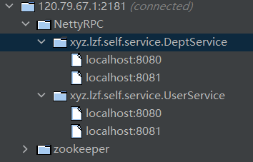
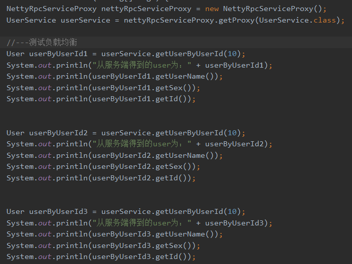
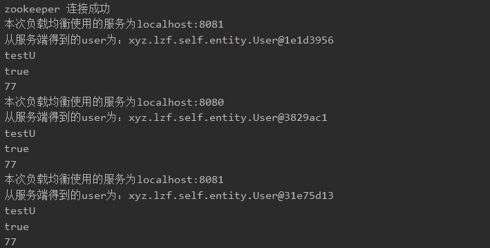

1.java io 与 netty 笔记 https://www.yuque.com/lzfbads3505621/ikqc2f/hgvtb0

2.ChannelInboundHandler : Netty中粘包与拆包问题与解决方案
https://www.cnblogs.com/rickiyang/p/12904552.html

3.测试:

修改不同的端口, 启动多个服务端, 查看zk效果如下:

启动一个客户端, 多次调用同一个接口, 测试负载均衡:

结果如下, 测试成功

